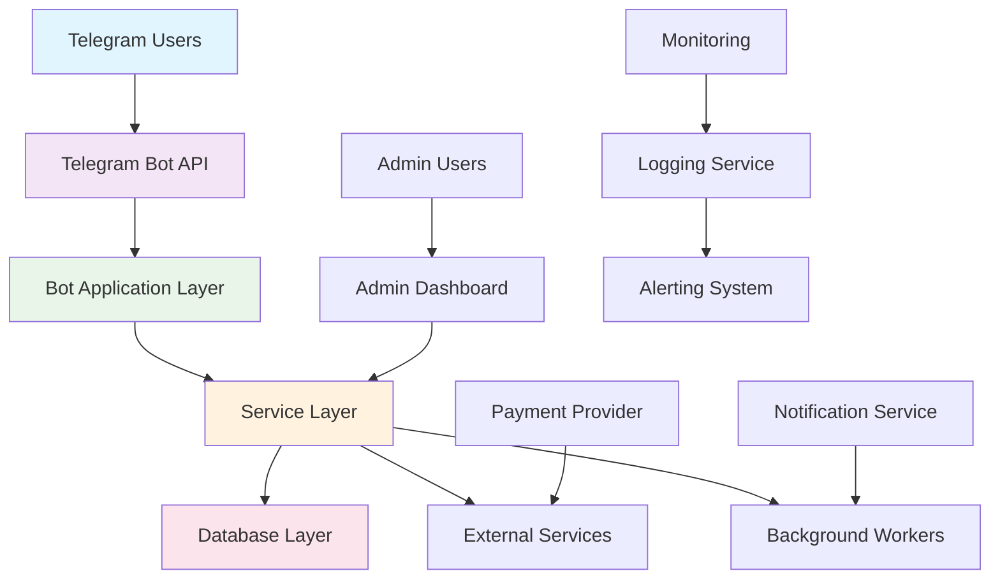
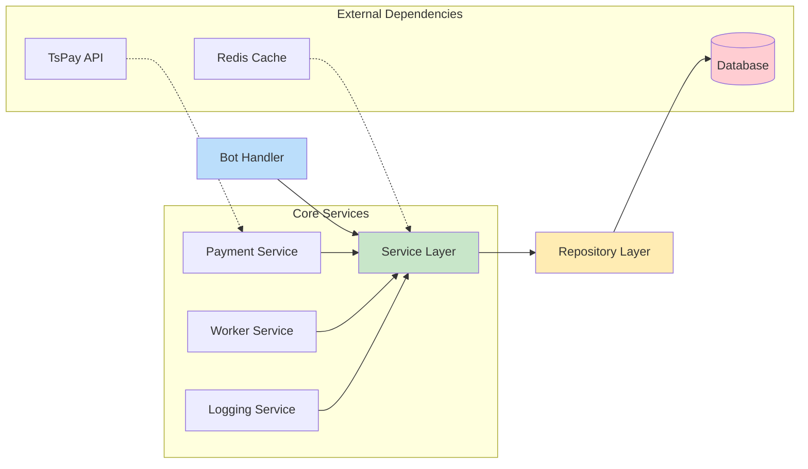
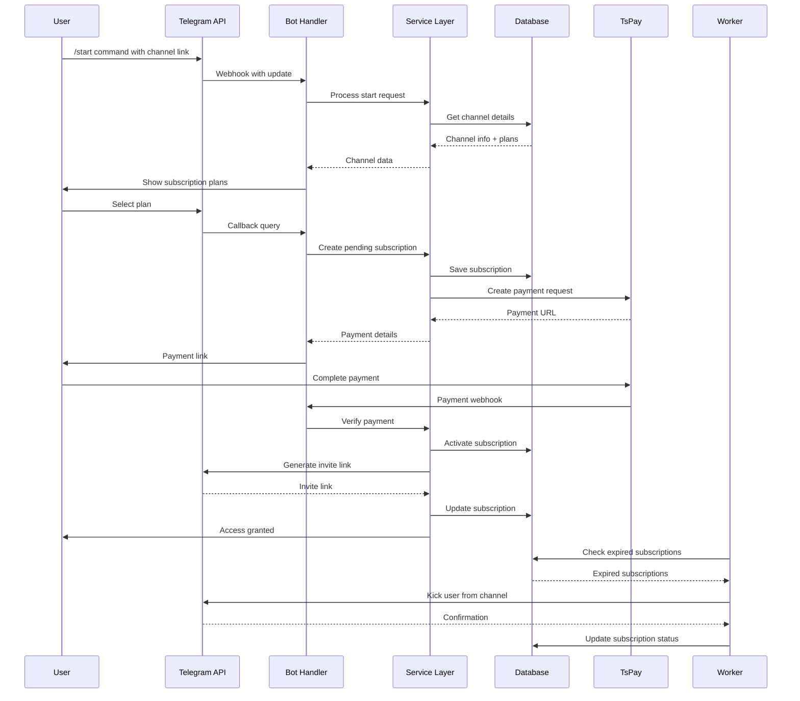

# 🏗️ Architecture Documentation

This document provides a comprehensive overview of the Telegram Paywall Platform architecture, design decisions, and system components.

## 📋 Table of Contents

- [System Overview](#system-overview)
- [Architecture Diagrams](#architecture-diagrams)
- [Component Architecture](#component-architecture)
- [Data Flow](#data-flow)
- [Technology Stack](#technology-stack)
- [Design Patterns](#design-patterns)
- [Security Architecture](#security-architecture)
- [Scalability Considerations](#scalability-considerations)

## 🌐 System Overview

The Telegram Paywall Platform is a distributed system designed to provide subscription-based access control for Telegram channels. It follows a microservices-inspired architecture with clear separation of concerns.

### Key Characteristics

- **Event-Driven**: Reacts to Telegram events and user interactions
- **Stateful**: Maintains user sessions and subscription states
- **Asynchronous**: Background workers handle time-based operations
- **Multi-tenant**: Supports multiple creators and channels
- **Real-time**: Immediate access control and notifications

## 📊 Architecture Diagrams

### High-Level Architecture



### Component Architecture



### Data Flow Diagram



## 🧩 Component Architecture

### 1. Bot Layer (`src/bot/`)

**Responsibility**: Handle all Telegram interactions and user sessions

**Components:**
- `bot.ts` - Main bot instance and startup logic
- `handlers/` - Command and callback handlers
  - `creator.ts` - Creator management commands
  - `subscriber.ts` - Subscription flow handlers
- `context.ts` - Extended context types
- `i18n.ts` - Internationalization system
- `i18nMiddleware.ts` - Language selection middleware

**Key Features:**
- Session management with Redis
- Multi-language support (UZ, EN, RU)
- Inline keyboard handling
- Deep link processing
- Error handling and fallback responses

### 2. Service Layer (`src/core/`)

**Responsibility**: Business logic and domain operations

**Services:**
- `creator.service.ts` - Creator management and wallet operations
- `subscriber.service.ts` - Subscription lifecycle management
- `ledger.service.ts` - Financial transaction recording
- `tspay.ts` - Payment provider integration
- `logger.service.ts` - Audit logging and notifications

**Repositories:**
- `user.repo.ts` - User data access
- `creator.repo.ts` - Creator data access
- `channel.repo.ts` - Channel data access
- `subscription.repo.ts` - Subscription data access

### 3. Database Layer (`src/db/`)

**Technology**: PostgreSQL with Prisma ORM

**Schema Entities:**
- `User` - Telegram user information
- `Creator` - Content creator profiles
- `Channel` - Monetized Telegram channels
- `SubscriptionPlan` - Pricing and duration options
- `Subscription` - User subscription records
- `Transaction` - Payment and financial records
- `CreatorBalance` - Wallet and payout tracking
- `Payout` - Creator withdrawal requests

### 4. Background Workers (`src/workers/`)

**Responsibility**: Asynchronous and scheduled operations

**Workers:**
- `expiration.ts` - Subscription expiration enforcement
  - Checks for expired subscriptions hourly
  - Automatically kicks users from channels
  - Revokes invite links
  - Updates subscription status
  - Sends expiration notifications

**Technology**: BullMQ with Redis backend

### 5. External Integrations

**Payment Processing:**
- **Provider**: TsPay (Uzbek payment system)
- **Integration**: Direct API calls with webhook verification
- **Security**: Token-based authentication
- **Features**: Payment creation, status checking, refund handling

**Telegram Integration:**
- **API**: Telegram Bot API
- **Communication**: Webhook or long polling
- **Features**: Message sending, user management, channel administration

## 🔧 Technology Stack

### Backend
- **Language**: TypeScript
- **Runtime**: Node.js 18+
- **Framework**: Grammy (Telegram bot framework)
- **Database**: PostgreSQL 15
- **ORM**: Prisma
- **Caching**: Redis 7
- **Queue**: BullMQ
- **Logging**: Winston

### Infrastructure
- **Containerization**: Docker
- **Orchestration**: Kubernetes (optional)
- **Reverse Proxy**: Nginx
- **SSL**: Let's Encrypt
- **Monitoring**: Prometheus + Grafana

### Development Tools
- **Build**: TypeScript compiler
- **Testing**: Jest (planned)
- **Linting**: ESLint + Prettier
- **Version Control**: Git
- **CI/CD**: GitHub Actions

## 🎨 Design Patterns

### 1. Repository Pattern
```typescript
// Data access abstraction
class UserRepository {
  async findByTelegramId(telegramId: bigint) {
    return prisma.user.findUnique({
      where: { telegramId },
      include: { creator: true, subscriptions: true }
    });
  }
}
```

### 2. Service Layer Pattern
```typescript
// Business logic separation
class CreatorService {
  async registerChannel(creatorUserId: number, channelTelegramId: bigint, title: string) {
    // Business validation
    // Data coordination
    // Transaction management
  }
}
```

### 3. Middleware Pattern
```typescript
// Cross-cutting concerns
function i18nMiddleware(ctx: MyContext, next: NextFunction) {
  // Language detection
  // Context enhancement
  return next();
}
```

### 4. Event-Driven Architecture
```typescript
// Background processing
const expirationWorker = new Worker('expiration-queue', async (job) => {
  await checkExpirations();
});
```

## 🔐 Security Architecture

### Authentication & Authorization
- **Bot Level**: Telegram Bot Token
- **User Level**: Telegram User ID verification
- **Channel Level**: Admin permission validation
- **Payment Level**: TsPay token authentication

### Data Protection
- **At Rest**: Database encryption
- **In Transit**: HTTPS/TLS encryption
- **In Memory**: Secure session handling
- **Logs**: Sensitive data filtering

### Input Validation
- **Type Safety**: TypeScript strong typing
- **Schema Validation**: Zod validation (planned)
- **Sanitization**: Input cleaning
- **Rate Limiting**: Request throttling

### Audit Trail
- **User Actions**: All user operations logged
- **Financial Transactions**: Complete payment audit
- **System Events**: Operational logging
- **Security Events**: Suspicious activity tracking

## 📈 Scalability Considerations

### Horizontal Scaling
- **Stateless Services**: Bot handlers can be scaled
- **Database Connection Pooling**: Prisma connection management
- **Redis Clustering**: Session and cache distribution
- **Load Balancing**: Multiple bot instances

### Performance Optimization
- **Caching Strategy**: 
  - Channel data (5-minute cache)
  - User sessions (Redis)
  - Frequently accessed plans
- **Database Optimization**:
  - Proper indexing
  - Query optimization
  - Connection pooling
- **Background Processing**:
  - Asynchronous operations
  - Queue-based processing
  - Batch operations

### Capacity Planning
**Current Capacity:**
- **Users**: 10,000+ concurrent users
- **Channels**: 1,000+ channels
- **Transactions**: 1,000+ payments/hour
- **Messages**: 10,000+ messages/hour

**Scaling Strategy:**
1. **Vertical Scaling**: Upgrade server resources
2. **Horizontal Scaling**: Add more instances
3. **Database Scaling**: Read replicas, partitioning
4. **Caching Layer**: Extended Redis caching

## 🔄 System Integration Points

### External APIs
1. **Telegram Bot API**
   - Webhook registration
   - Message sending
   - User/channel management
   - File/document handling

2. **TsPay Payment API**
   - Transaction creation
   - Payment status verification
   - Refund processing
   - Webhook notifications

### Internal APIs
1. **Health Check Endpoint**
   - Service status monitoring
   - Dependency health checks
   - Performance metrics

2. **Admin Dashboard API** (planned)
   - User management
   - Analytics and reporting
   - System configuration
   - Support tools

## 📊 Monitoring and Observability

### Key Metrics
- **Bot Performance**: Response times, error rates
- **Database**: Query performance, connection pool
- **Payments**: Transaction success rates, processing times
- **Users**: Active users, subscription rates
- **System**: CPU, memory, disk usage

### Alerting Strategy
- **Critical**: Payment failures, database down
- **Warning**: High error rates, performance degradation
- **Info**: New registrations, successful payments
- **Security**: Suspicious activity, unauthorized access

### Logging Strategy
- **Structured Logging**: JSON format for parsing
- **Log Levels**: Error, Warn, Info, Debug
- **Context Enrichment**: User ID, request ID, timestamps
- **Centralized Storage**: File system and external services

## 🚀 Future Architecture Improvements

### Planned Enhancements
1. **Microservices Architecture**: Split into independent services
2. **Event Sourcing**: Complete event-driven architecture
3. **CQRS**: Separate read/write models
4. **API Gateway**: Centralized request routing
5. **Service Mesh**: Istio for service communication

### Technology Upgrades
1. **Database**: Consider TimescaleDB for time-series data
2. **Caching**: Redis Cluster for high availability
3. **Message Queue**: Apache Kafka for high-throughput
4. **Monitoring**: Full Prometheus/Grafana stack
5. **Tracing**: OpenTelemetry implementation

---

*This architecture document is maintained and updated with each major release.*
*Last updated: January 2026*